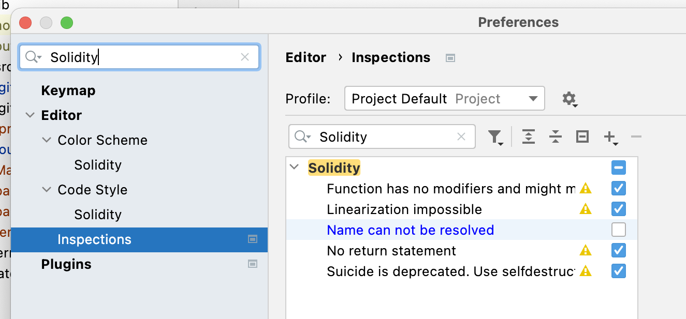
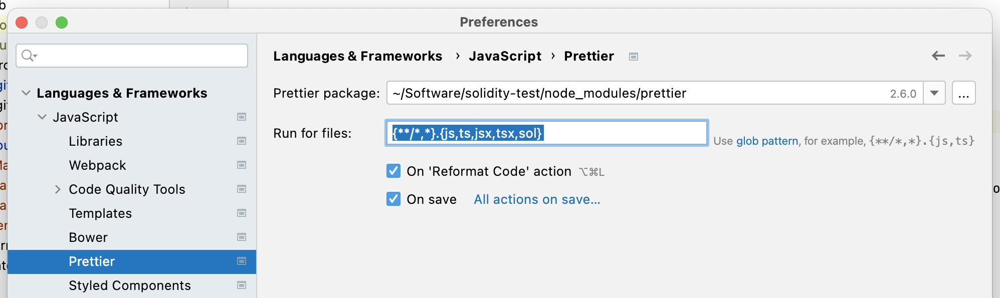

# Forge Template

This is a clone of [gakonst/femplate](https://github.com/gakonst/femplate) and [abigger87/femplate](https://github.com/abigger87/femplate) with support for `dapptools` removed and **VS Code** settings replaced with **WebStorm** settings for users already in the JetBrains ecosystem.

It uses `prettier` for linting and formatting and [Foundry](https://github.com/gakonst/foundry) for the testing, deploying, etc. of Solidity contracts.

It includes a number of helper scripts as well as **pre-configured run configurations for WebStorm**.

## Prerequisites

1. `npm`
2. `make`
3. `solc-select`
4. `foundryup` / `foundry`
5. **WebStorm** or another JetBrains IDE

## Getting Started

```shell
# install solc-select
pip3 install solc-select

# install foundryup / foundry
# nota bene: replace `.bash_profile` as necessary 
curl -L https://foundry.paradigm.xyz | bash && . ~/.bash_profile && foundryup

# clone this repo
git clone git@github.com:lattejed/forge-template.git && cd ./forge-template

# install submodule deps
make install-libs

# install solc
make install-solc

# install other deps
npm install

# sanity check
make test
```

## WebStorm Settings

The WebStorm Solidity plugin doesn't currently have support for remappings, so you may want to disable name resolution to prevent warnings in the editor.



You can also set up `prettier` to run on format and save. Make sure the package references the `prettier` module under `node_modules` and add `sol` to the list of extensions. 



## Disclaimer

_These smart contracts are being provided as is. No guarantee, representation or warranty is being made, express or implied, as to the safety or correctness of the user interface or the smart contracts. They have not been audited and as such there can be no assurance they will work as intended, and users may experience delays, failures, errors, omissions, loss of transmitted information or loss of funds. The creators are not liable for any of the foregoing. Users should proceed with caution and use at their own risk._
